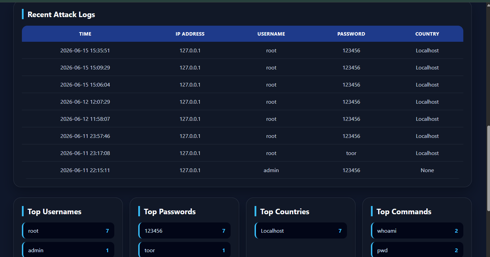
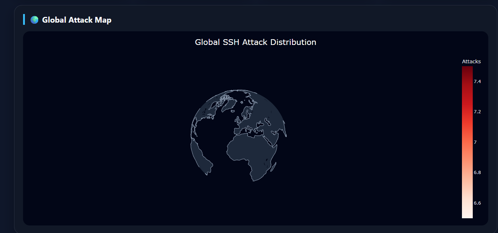
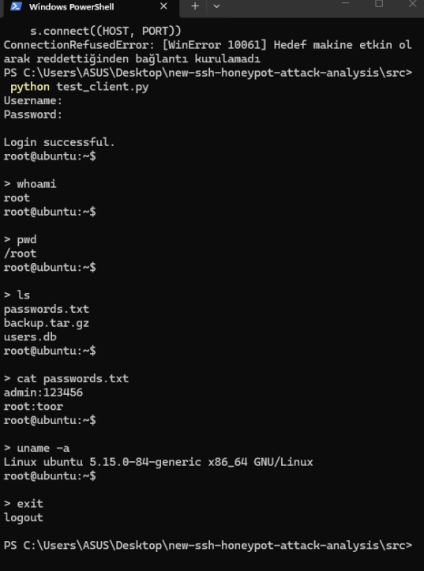
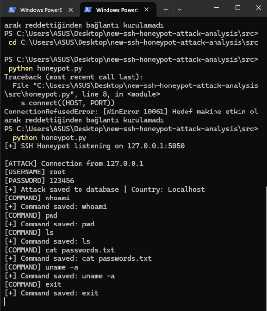

# Design and Implementation of an SSH Honeypot for Attack Analysis

## Overview

This project presents the design and implementation of a medium-interaction SSH honeypot developed for cybersecurity research, attack monitoring, and behavioral analysis. The system simulates an SSH service, records attacker activities, and provides a web-based dashboard for attack visualization and analysis.

The proposed platform captures authentication attempts, simulates post-login attacker interactions, identifies attack origins using GeoIP technologies, and stores collected information in a SQLite database.

---

## Research Objectives

The main objectives of this project are:

* To design and implement a medium-interaction SSH honeypot.
* To monitor SSH-based attack attempts.
* To collect attacker usernames and passwords.
* To analyze post-authentication attacker behavior.
* To identify attack origins using GeoIP technologies.
* To visualize collected threat intelligence through a web dashboard.
* To support cybersecurity education and attack analysis activities.

---

## Features

* SSH Honeypot Service
* Username and Password Logging
* SQLite Database Storage
* GeoIP-Based Country Detection
* Interactive Flask Dashboard
* Command Execution Logging
* Medium-Interaction Fake Shell
* Top Commands Analytics
* Top Countries Analytics
* World Map Visualization
* Docker Deployment Support
* Recent Attack Log Monitoring
---

## Project Structure

```text
ssh-honeypot-attack-analysis
│
├── dashboard
├── database
├── demo
├── docker
├── docs
├── geoip
├── research
├── screenshots
├── src
│
├── Dockerfile
├── requirements.txt
├── README.md
└── LICENSE
```

---

## Technologies Used

* Python
* Flask
* SQLite
* Plotly
* Pandas
* GeoIP2
* Docker

---

## Installation

Clone the repository:

```bash
git clone https://github.com/SeherBalibay/ssh-honeypot-attack-analysis.git
cd ssh-honeypot-attack-analysis
```

Install dependencies:

```bash
pip install -r requirements.txt
```

Run the honeypot:

```bash
cd src
python honeypot.py
```

Run the dashboard:

```bash
cd dashboard
python app.py
```

Open the dashboard:

```text
http://127.0.0.1:5000
```

---

## Dashboard Capabilities

The dashboard provides:

* Recent attack logs
* Top usernames
* Top passwords
* Top countries
* Most frequently executed commands
* GeoIP-based attack visualization
* World attack map

---

## Screenshots

### Dashboard



### World Attack Map



### Fake Shell



### Command Logging



---

## Educational Purpose

This project was developed for academic and cybersecurity research purposes. The collected data is intended for attack analysis, security awareness, and threat intelligence studies in controlled environments.

---

## Future Improvements

* Public Cloud Deployment
* Real-World Attack Collection
* Advanced SSH Service Emulation
* Enhanced Medium-Interaction Shell Environment
* Threat Intelligence Feed Integration
* Automated Alert and Reporting System
* Machine Learning-Based Attack Classification

---

## Literature Review

The theoretical background and literature review used in this project are documented in:

```text
research/literature-review.md
```

The literature review covers honeypot technologies, SSH attack analysis, threat intelligence concepts, and related academic studies.

---

## Author

Seher Balibay

---

## License

MIT License
